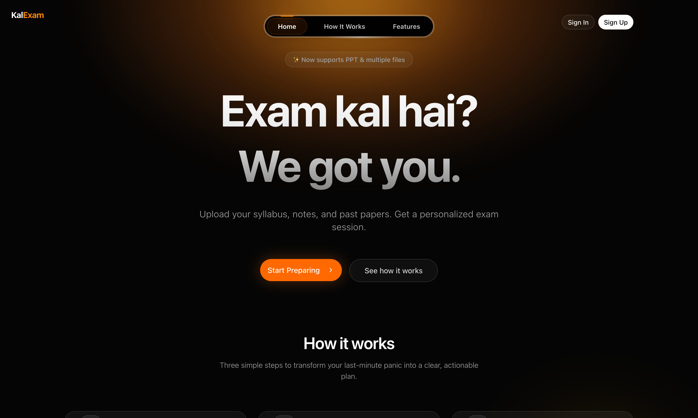
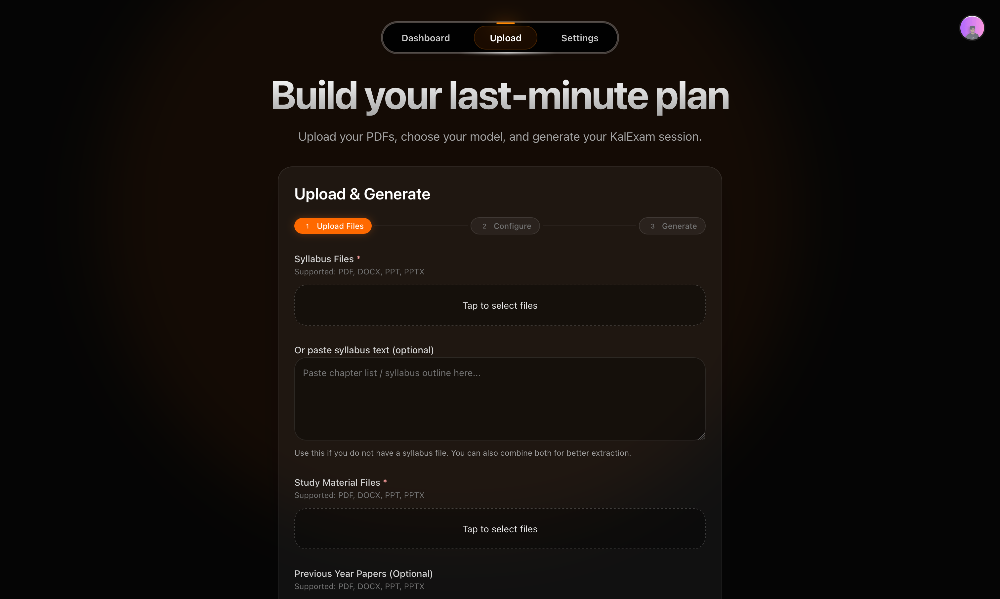
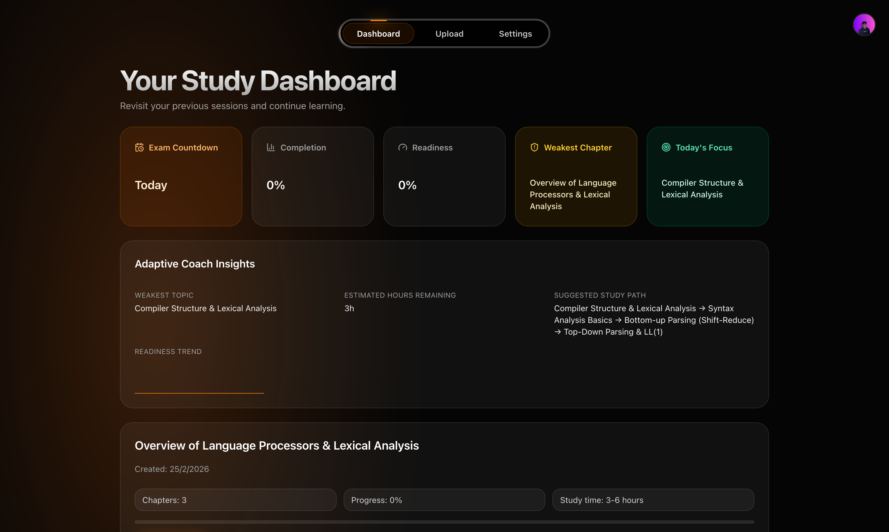
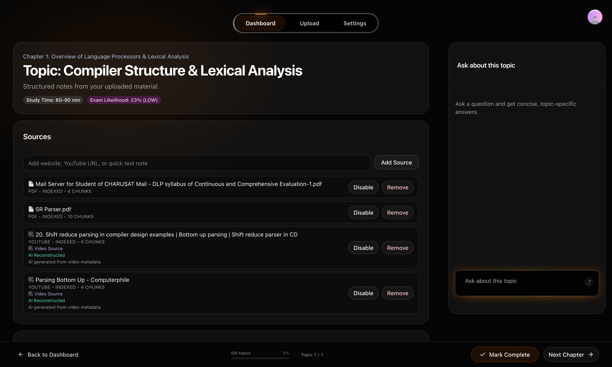

# KalExam

> **AI-Powered Last-Minute Exam Prep** — Upload your syllabus, get a personalized study strategy, and walk into your exam ready.

[](https://nextjs.org)
[](https://www.typescriptlang.org)
[](https://firebase.google.com)
[](https://ai.google.dev)
[](./LICENSE)

---



---

## What is KalExam?

**KalExam** ("Kal" means "tomorrow" in Hindi — as in, *exam kal hai*) is a full-stack AI application that helps students prepare for exams intelligently, especially under time pressure.

Students upload their syllabus and study materials — PDFs, Word docs, PowerPoints, YouTube lecture links, or raw URLs — and KalExam generates a prioritized study strategy using an AI pipeline. The platform then provides a rich, interactive study interface: streamed explanations, contextual Q&A, micro-quizzes, and a live exam readiness score.

---

## Screenshots

| Landing | Upload |
|---|---|
|  |  |

| Dashboard | Study Interface |
|---|---|
|  |  |

---

## Features

### Strategy Generation
Upload your syllabus and study materials and KalExam runs a multi-stage AI pipeline to extract chapters, score each topic by exam likelihood, and produce a prioritized learning plan. The job runs asynchronously — no waiting on a loading screen. The client polls for progress while the server precomputes the top recommended topics in the background.

**Supported input formats:** PDF, DOCX, PPT/PPTX, YouTube URLs (with transcript fetch + AI reconstruction fallback), website URLs, plain text.

### Interactive Study Interface
Each topic has its own dedicated study page with:

- **Learn Now cards** — streamed explanations with concept, worked example, exam tip, and a typical exam question for each learning item
- **Micro-quizzes** — per-item quizzes at easy / medium / hard difficulty, generated on demand
- **Quick actions** — one-click prompts: *What's the difference?*, *Give me an example*, *Likely exam question*, *Explain simply*
- **Exam Mode** — generates 3 likely exam questions + a readiness score (0–100) + weak areas + a revision tip
- **Chat panel** — multi-turn contextual Q&A against the student's own study materials, streamed via SSE, with per-question response caching

### Smart Recommendations
A six-factor scoring algorithm determines what to study next:
- Exam likelihood score (from AI analysis)
- Chapter weightage
- Unfinished topic bonus
- Priority tier (critical / high / medium / low)
- Time-remaining factor
- Completion status

### RAG Pipeline
All AI answers are grounded in the student's actual study materials, not just general knowledge. The retrieval pipeline uses BM25-style token scoring with source-type priority boosts (Previous Papers > Question Banks > Study Materials > Syllabus). Supports query expansion via Gemini for better recall.

### Source Management
Students can add or remove sources at any time from the study interface — YouTube videos, website URLs, or text snippets. Each source is chunked and indexed into Firestore. Toggling sources invalidates the relevant caches and updates the RAG index live.

### Dashboard Intelligence
The dashboard shows a real-time intel panel per study session:
- Exam countdown
- Overall completion percentage
- Current readiness score
- Weakest chapter at a glance
- Today's recommended focus topic
- Readiness trend sparkline

### PDF Report Export
Download a multi-page PDF strategy report including chapter summaries, topic weightage, material coverage, and progress badges (not started / learning / completed).

### Account & Preferences
- Email/password and Google OAuth sign-in
- User settings: display name, password change, default model, default study hours
- Per-user preferences persisted to Firestore

---

## Tech Stack

| Layer | Technology |
|---|---|
| Framework | Next.js 16.1 (App Router), React 19, TypeScript 5 |
| Styling | TailwindCSS v4, shadcn/ui (Radix UI primitives) |
| Animation | Framer Motion 12 |
| Authentication | Firebase Auth (email/password + Google OAuth) |
| Database | Firestore (client + Admin SDK) |
| File Storage | Firebase Storage |
| AI — Primary | Google Gemini (2.0 Flash, 2.5 Pro Preview) |
| AI — Secondary | Custom OpenAI-compatible endpoint (bring your own) |
| AI Routing | Dual-model router: FAST for simple tasks, SMART for complex ones |
| Streaming | Server-Sent Events (SSE) for chat and Learn Now cards |
| File Parsing | pdf-parse, mammoth (DOCX), custom PPT/PPTX parser |
| YouTube | youtube-transcript + AI reconstruction fallback |
| URL Ingestion | Custom HTML stripper and chunker |
| PDF Export | jsPDF (client-side, multi-page) |
| Markdown | react-markdown + remark-gfm |
| List Virtualization | react-window |

---

## Architecture

### Async Strategy Pipeline
Strategy generation does not block the UI. The server creates a job record and immediately returns a job ID. A background worker runs through five stages — `extracting_text → analyzing_chapters → generating_strategy → preparing_study_content → complete` — while the client polls for status. Top recommended topics are precomputed during the preparation stage so the study interface loads instantly.

### Dual-Model AI Router
Every AI call is routed through a model selector that picks between a FAST model (Gemini Flash) and a SMART model (Gemini Pro). The router auto-upgrades to the SMART model if the fast model returns output that is too short, too generic, or fails JSON schema validation.

### Multi-Layer Caching
- **Study content cache**: per-topic, keyed by a cryptographic signature of the source file URLs and model version. Invalidated automatically when sources change.
- **Chat cache**: per-question, per-model, stored in the study session document.
- **YouTube transcript cache**: reconstructed transcripts stored in a global Firestore collection, keyed by video ID and model.
- **Fallback detection**: low-quality AI responses are detected and not cached, triggering a SMART model retry.

### RAG Retrieval
Chunks are stored in Firestore with token-overlap metadata. At query time, BM25-style scoring ranks chunks, source-type priority boosts are applied, and diversity constraints ensure results span multiple source types (e.g., not all chunks from the same file). Query expansion is available via a secondary Gemini call.

---

## Getting Started

### Prerequisites
- Node.js 18+
- A Firebase project with Firestore, Authentication, and Storage enabled
- A Google Gemini API key (or a custom OpenAI-compatible endpoint)

### Installation

```bash
git clone https://github.com/nihar5hah/kalexam.git
cd kalexam
npm install
cp .env.example .env.local
```

### Environment Variables

Edit `.env.local` with your credentials:

```
# Firebase (client-side)
NEXT_PUBLIC_FIREBASE_API_KEY=
NEXT_PUBLIC_FIREBASE_AUTH_DOMAIN=
NEXT_PUBLIC_FIREBASE_PROJECT_ID=
NEXT_PUBLIC_FIREBASE_STORAGE_BUCKET=
NEXT_PUBLIC_FIREBASE_MESSAGING_SENDER_ID=
NEXT_PUBLIC_FIREBASE_APP_ID=

# Firebase Admin SDK (server-side, for RAG chunk reads)
GCP_SERVICE_ACCOUNT=            # Preferred on Firebase App Hosting (full JSON as single string)
FIREBASE_SERVICE_ACCOUNT_KEY=   # Also supported fallback name
FIREBASE_CLIENT_EMAIL=
FIREBASE_PRIVATE_KEY=
FIREBASE_PROJECT_ID=

# AI Provider
GEMINI_API_KEY=
```

### Run Locally

```bash
npm run dev
# Runs on http://localhost:3000
```

### Build

```bash
npm run build
```

---

## Project Structure

```
src/
├── app/
│   ├── page.tsx                  # Landing page
│   ├── auth/page.tsx             # Sign in / Sign up
│   ├── upload/page.tsx           # Strategy generation form
│   ├── dashboard/page.tsx        # Session list + intel panel
│   ├── study/[topic]/page.tsx    # Per-topic study interface
│   ├── settings/page.tsx         # Account settings
│   └── api/
│       ├── generate-strategy/    # Strategy job creation + polling
│       └── study/                # Chat, exam mode, learn items, quizzes
├── components/
│   ├── study/                    # Study page sub-components
│   ├── dashboard/                # Dashboard sub-components
│   └── ui/                       # shadcn + custom primitives
└── lib/
    ├── ai/                       # AI client, model router, strategy orchestrator
    ├── firestore/                # All Firestore read/write logic
    ├── parsing/                  # File parsers + chunker
    └── study/                    # RAG pipeline, exam likelihood, caching
```

---

## API Overview

| Method | Endpoint | Description |
|---|---|---|
| `POST` | `/api/generate-strategy/jobs` | Start a strategy generation job |
| `GET` | `/api/generate-strategy/jobs?id=` | Poll job status |
| `GET` | `/api/generate-strategy/jobs/recover` | Recover a stuck job |
| `POST` | `/api/sources/index` | Index a new source into the RAG store |
| `POST` | `/api/study/topic` | Get AI-generated study content for a topic |
| `POST` | `/api/study/ask` | Chat Q&A (streaming) |
| `POST` | `/api/study/exam-mode` | Get readiness score + likely questions |
| `POST` | `/api/study/learn-item` | Deep-dive explanation for a learning item (streaming) |
| `POST` | `/api/study/micro-quiz` | Generate a quiz question for a learning item |

---

## Roadmap

### In Progress
- [ ] Cloud Tasks integration to replace in-memory job store for production scalability
- [ ] Enhanced PDF reports (student name, exam date, generated timestamp)
- [ ] Persistent session recovery across page refreshes

### Planned
- [ ] Spaced repetition scheduling
- [ ] Personalized mock exams
- [ ] Mobile app (React Native)
- [ ] Offline study mode

---

## Security

- All authenticated routes are protected server-side via Firebase Admin SDK token verification
- Firestore security rules scope all data reads and writes to the authenticated user's UID
- Uploaded files are stored in Firebase Storage with per-user path isolation
- API keys are stored exclusively in server-side environment variables and never exposed to the client
- AI response caches are keyed with cryptographic file signatures to prevent stale data from being served after source updates

---

## License

[MIT](./LICENSE)

---

## Author

**Nihar Shah**  
[github.com/nihar5hah](https://github.com/nihar5hah)
